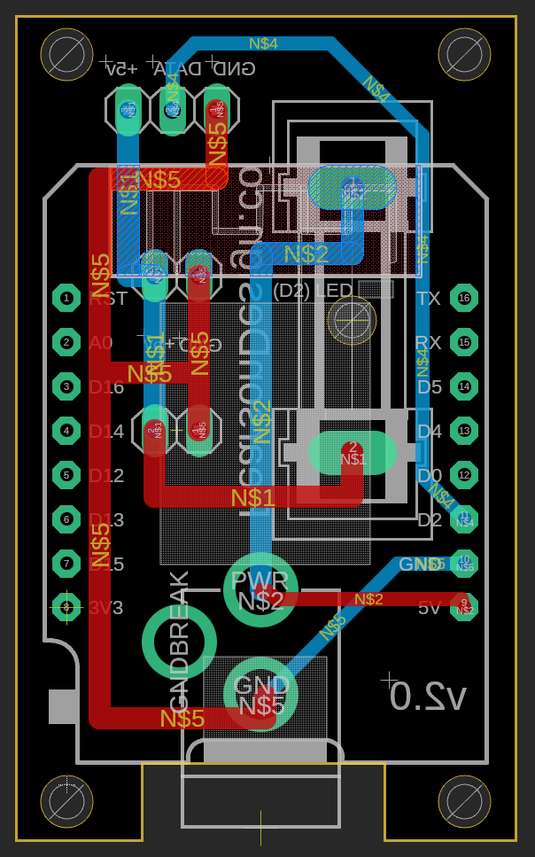
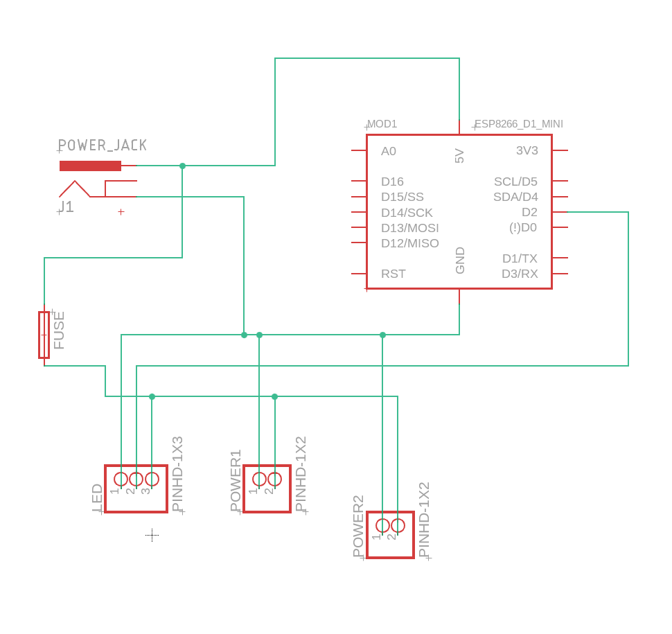
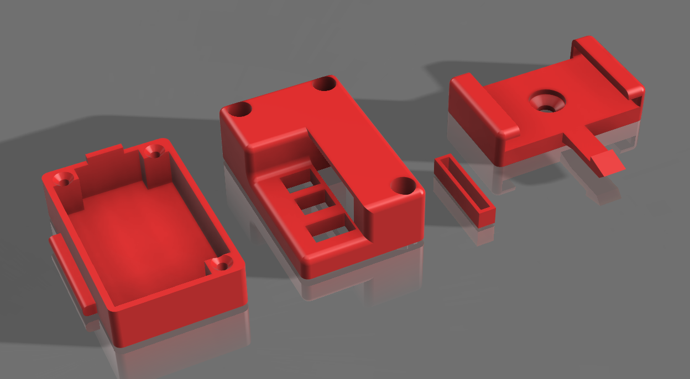

<iframe width="100%" src="https://www.youtube.com/embed/hE9B4bpsDIw" title="WLED Controller | DIY LED Strip Controller" frameborder="0" allow="accelerometer; clipboard-write; encrypted-media; gyroscope; picture-in-picture; web-share" allowfullscreen></iframe>

## About

This project is for a custom LED controller board.  My goal of this project was to have a board that:
* Runs [WLED](https://kno.wled.ge) firmware;
* Uses inexpensive components and is simple to assemble;
* Has a small(ish) form factor;
* Uses a common 5.5x2.1mm barrel jack for power input;
* Uses common JST 2.54 connectors for the LED strips;
* Presence of a replaceable fuse;
* Enclosure that allows for mounting, as well as serviceability;

I also just enjoy a good challenge.

:::danger
I am not an electrical engineer.  This board design has flaws, only some of which are known by me.  Use with caution.

There are a plethora of other WLED controller boards out there, most of which are probably better designed than this one.  This project is just for fun, and shouldn't be used for any critical LED controlling operations.
:::

## Parts List

You'll need the following components, along with a custom PCB and some 3D prints.

### Components

| Item | Link |  Notes |
| --- | --- | --- |
| ESP8266 | [Amazon](https://www.amazon.com/dp/B0BK986HLZ?ref=ppx_yo2ov_dt_b_product_details&th=1) | This is the USB C variant.  Micro USB can be had for significantly cheaper, and any "d1 mini" form factor will work |
| 5.5x2.1mm Barrel Jack | [Amazon](https://www.amazon.com/dp/B081DYQSC9?ref=ppx_yo2ov_dt_b_product_details&th=1) | These specific jacks have wider legs that make soldering easier |
| 5x20mm Fuse Holder | [Amazon](https://www.amazon.com/gp/product/B074N1NMMX/ref=ppx_yo_dt_b_asin_title_o03_s00?ie=UTF8&psc=1) | Alternative fuse holders may require some modifications to the enclosure top |
| Fuse assortment | [Amazon](https://www.amazon.com/gp/product/B07TXFHR5J/ref=ppx_yo_dt_b_asin_title_o03_s00?ie=UTF8&psc=1) | These particular fuses are rated in AC current, which makes converting a bit tricky |
| M3x8 Screws | [Amazon](https://www.amazon.com/dp/B07Q4N4V1V?ref=ppx_yo2ov_dt_b_product_details&th=1) | Need 3 for this build |
| JST XH 2.54 2 pin | [Amazon](https://a.co/d/3dqOVPY) | Comes with male wires as well, any 2 pin 2.54 JST XH connector will work though |
| JST XH 2.54 3 pin | [Amazon](https://a.co/d/aD3Sctu) | Also comes with male wires, but **need to be repinned** prior to using |

### PCB

| Board | Schematic |
| --- | --- |
|  |  |

The board design is pretty simple.  I had 25 boards manufactured by [JLCPCB](https://jlcpcb.com) for less than $10 (including shipping).  Other competitive services exist for PCB manufacturing however, so do your research before picking one.

The gerber files can be downloaded [here](./assets/gerber_files.zip).  You'll need to input these files into whatever service you use for manufacturing.

### 3D Prints

| File | Description | Recommended Settings |
| --- | --- | --- |
| [Top](./assets/WLedCaseTop.3mf) | Top part of the enclosure | Print upside-down, support enabled |
| [Bottom](./assets/WLedCaseBottom.3mf) | Bottom of enclosure | No support needed, 100% infill |
| [Holder](./assets/WLedCaseHolder.3mf) | Bracket for mounting the controller | support enabled, 100% infill in the overhang section |
| [Spacer](./assets/WLedCaseSpacer.3mf) | Spacer that separates the PCB from the WS2812B |

I print these on a Bambu Labs X1C, using ASA filament.  ASA is not required, nor is a super expensive printer, but PLA is not recommended for outdoor use.

## Assembly

There is an order of operations that must be followed.  Follow the video guide for assembly.

## Firmware

This board is meant to run [WLED](https://kno.wled.ge).  After flashing firmware, no additional setup is required.

## Flaws

Couple of known problems with this board design:
* Only supports 5v LED strips:
    * Can't use other strips such as 12v;
* No capacitor:
    * This isn't an issue when using a good power supply, but if using a cheaper supply (such as in a car), then issues may pop up.  Power does run near the WiFi antenna, and this could cause interference issues;
* Small pads:
    * Some of these solder joints are harder than they need to be, should've made the pads bigger;
* JST connectors point straight up:
    * If I redesign this board, the JST connectors will be the 90 degree variety;

Other issues (based on YouTube feedback, which I'm thankful for):

* Missing logic-level shifter:
    * While I've never ran into any issues with the WS2812b lighting strips (BTF-Lightning brand), official WLED documentation recommends usage of a logic level shifter, given that the esp8266 outputs a 3.3v signal, and the led strips operate on 5v;
* Usage of an ESP32:
    * ESP8266s can get a bit slow on WLED (and in my experience are more prone to crashing), plus OTA update support would be nice;

### V3 Planning

While the next version of this board is still early in the planning phase, there are a few things I want to do differently:

* SMD ESP32 module:
    * Rather than purchasing expensive-ish ESP8266 boards, you can order ESP32 SOCs and SMD solder them.  Services like JLCPCB have these in their inventory, and can even perform the assembly for cheap.  This would decrease the assembly complexity (for me), and provide a significantly more powerful MCU;
    * This would additionally remove the USB port and unnecessary hardware.  Instead, I'd need to add UART headers and flash the firmware with a programmer, which is acceptable;
    * I'd have to design the board to be almost completely single-sided. Since the V2 board uses spacers with THT components to keep everything compact, this would be a design challenge;
* Horizontal JST headers:
    * The board would look a bit better if the output headers were horizontal, then the wiring wouldn't stick up so high;
* LED voltage independence:
    * It would be nice if I could decouple the MCU voltage from the LED strip voltage, allowing the same board to run 12v strips.  This can probably just be done with a 3.3v voltage regulator on the input side, then a logic level shifter for the data transmission pin;
    * This would make it so that if you wanted to run 12v strips, just plug in a 12v strip and power the controller with 12v.  For 5v strips, just use a 5v supply & strip.  No need to configure a jumper or anything to select the appropriate voltage;
    * I need to perform more research on appropriate components.  Most ESP32 packages have a pretty small current consumption on their own, so the voltage regulator should be straightforward;
* Different fuse size:
    * The current fuses I'm using are cheap and easy to source, but are rated in high AC current, which doesn't nicely convert to 5v dc.  I could go the route of automotive fuses, as the 12v is much easier to convert, but will need to source some holder components and find a cheap supply of fuses.  I went with the current fuse holders due to their relatively small size, and I'd like to keep that;

Lastly, I don't want to copy any other board designs.  I didn't reference any other boards when designing this, or even the WLED documentation (which I probably should have).  This project is simply meant to be an exercise, to grow my skills in an area that I am unfamiliar with.